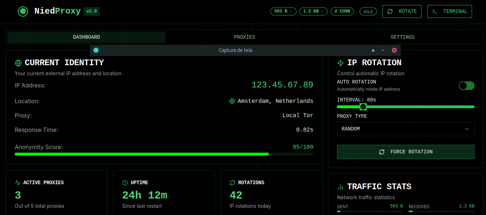

# NiedProxy-v2

´´´bash


------------------------------





##  Uso e explicação das funções do Nied-Proxy


IP changer desenvolvido primeiramente em python, mas gaora foi feito uma atualização que utiliza typescript. O Nied-proxys  utiliza proxies Socks5 com roteamento Onion (Tor) para aumentar o anonimato e a segurança de uma máquina. Alterna automaticamente os proxies com base em condições lógicas configuradas pelo usuário por uma interface

---

## Funcionalidades

- Alternância periódica de proxies para maior anonimato
- Suporte a TLS, PGP e SSH
- Adição de URLs de proxies privados
- Código open source e customizável

---

## Instalação

### Linux

```bash
npm install -g typescript

Ou local no projeto:

npm install --save-dev typescript

npx tsc


```


Windows
    
          npm install -g typescript

          Ou local no projeto:
 
          npm install --save-dev typescript

         npx tsc

    
## Personalização

Você pode editar o código para adicionar listas personalizadas de proxies ou ajustar a lógica de alternância.
Contribuindo

    Fork o repositório

    Clone seu fork:

git clone https://github.com/seu-usuario/NiedProxy-v2.git
cd NiedProxy-v2

    Crie uma branch:

git checkout -b minha-nova-feature

    Faça as alterações e commit:

git add .
git commit -m "feat: adiciona nova funcionalidade"

    Envie para o fork:

git push origin minha-nova-feature

    Abra um Pull Request


    

## Licença

MIT — sinta-se livre para usar, modificar e distribuir.
Tecnologias

    Typescript

    Socks5

    Tor (Proxychains)

    TLS / PGP / SSH

